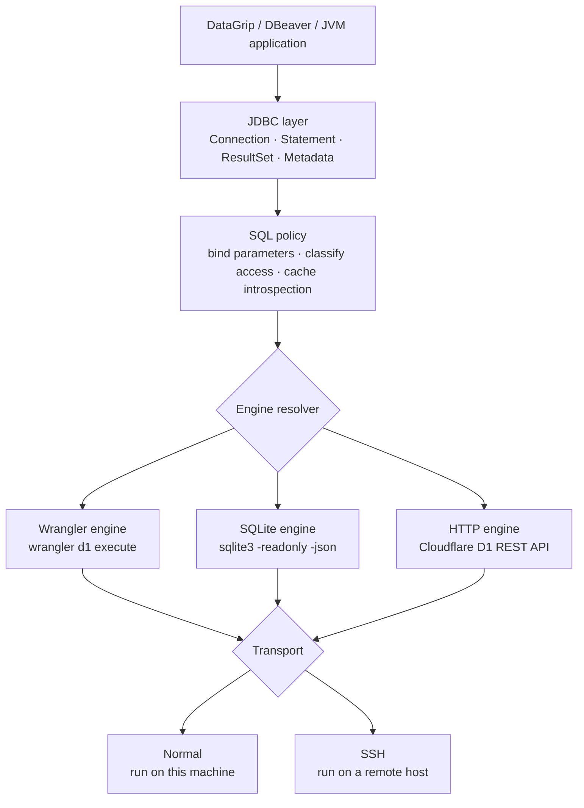

<!-- markdownlint-disable MD013 MD033 MD041 -->

<p align="center">
  
</p>

<h1 align="center">d1-jdbc-driver</h1>

<p align="center">
  An unofficial JDBC bridge for Cloudflare D1.<br>
  Browse local Miniflare data and remote D1 databases from DataGrip, DBeaver, or any JVM application.
</p>

<p align="center">
  
  
  
  
  
</p>

<!-- markdownlint-enable MD033 MD041 -->

> [!IMPORTANT]
> This project is community-built and is not affiliated with or endorsed by Cloudflare.

## Why this driver?

[Cloudflare D1](https://developers.cloudflare.com/d1/) documents three query
paths—Workers bindings, the REST API, and Wrangler—but none speaks JDBC. That
makes excellent database tools such as DataGrip and DBeaver difficult to use,
especially when a project has local Miniflare data and multiple remote
environments.

`d1-jdbc-driver` adapts D1's existing interfaces into the JDBC model:

- one JDBC URL for local, preview, and production databases;
- SQLite-aware schema discovery for tables, views, columns, keys, and indexes;
- three interchangeable query engines: Wrangler, direct SQLite, and D1 HTTP;
- local execution or transparent execution on another machine over SSH;
- read-only access by default, with explicit opt-in for writes and DDL;
- a self-contained JAR that can be loaded directly by desktop database clients.

It is a JDBC adapter, not a database proxy. There is no daemon, listening port,
or persistent database socket.

## Quick start

### 1. Build the driver

The Nix shell supplies JDK 21; the checked Gradle wrapper produces Java 17
bytecode and the self-contained driver JAR.

```bash
nix develop -c ./gradlew clean build
```

The artifact is written to:

```text
build/libs/d1-jdbc-driver-0.1.0-SNAPSHOT.jar
```

### 2. Choose a connection

Fast local browsing:

```text
jdbc:d1:?db=my-app-local&mode=local&persist=/absolute/path/to/.wrangler/state
```

Remote D1 over the HTTP API:

```text
jdbc:d1:?db=my-app-preview&mode=remote&account=<account-id>&database-id=<database-uuid>&dir=/absolute/path/to/project
```

Run the same remote connection from a development server:

```text
jdbc:d1:?transport=ssh&host=devbox&db=my-app-preview&mode=remote&account=<account-id>&database-id=<database-uuid>&dir=/srv/my-app
```

### 3. Load it in DataGrip

1. Open **Data Sources and Drivers**.
2. Under **Drivers**, create a driver named `Cloudflare D1`.
3. Add the JAR under **Driver Files**.
4. Select `io.github.dravengarden.d1.jdbc.D1Driver` as the driver class.
5. Set the SQL dialect to **SQLite**.
6. Create a data source, paste a URL from above, and run **Test Connection**.

The driver performs a dependency preflight and `SELECT 1` before returning a
connection. Disable that behavior with `probe=false` only when necessary.

## Architecture



Three independent settings determine the route:

- **mode** selects the data: `local` or `remote`;
- **engine** selects how SQL reaches that data: `wrangler`, `sqlite`, or `http`;
- **transport** selects where the engine process runs: `normal` or `ssh`.

Every engine produces the same internal tabular result, so the JDBC layer does
not depend on how or where a query ran.

## Choosing an engine

| Goal | Recommended configuration | Engine host needs |
| --- | --- | --- |
| Browse local Miniflare data | `mode=local&persist=...` | `sqlite3`, `find` |
| Write to local D1 | `mode=local&engine=wrangler&access=write` | [Wrangler](https://developers.cloudflare.com/d1/wrangler-commands/) |
| Query remote D1 with low startup overhead | `mode=remote&account=...&database-id=...` | `curl` and small POSIX helpers |
| Match project-specific Wrangler behavior | `mode=remote&engine=wrangler` | Wrangler |
| Reach data that exists on a dev server | add `transport=ssh&host=...` | the selected engine plus `sshd` |

`engine=auto` is the default and resolves as follows:

1. local + read access + a resolvable SQLite file → `sqlite`;
2. remote + `account` + `database-id` → `http`;
3. otherwise → `wrangler`.

Writable local connections deliberately resolve to Wrangler because the SQLite
engine is always opened read-only.

## Connection URL

```text
jdbc:d1:?db=<name>&mode=<local|remote>&transport=<normal|ssh>&...
```

All non-secret values may be supplied either in the URL or as JDBC properties.
URL values take precedence. The Cloudflare token is the exception: the driver
only accepts it from the JDBC `password` property or from the engine host's env
file/environment.

### Core options

| Parameter | Default | Description |
| --- | ---: | --- |
| `db` | required | D1 database name; used by Wrangler and in diagnostics |
| `mode` | `local` | Select `local` Miniflare data or a `remote` cloud database |
| `engine` | `auto` | `auto`, `wrangler`, `sqlite`, or `http` |
| `transport` | `normal` | Run locally (`normal`) or on an SSH host (`ssh`/`proxy`) |
| `dir` | — | Working directory on the engine host |
| `access` | `read` | Client-side access tier: `read`, `write`, or `ddl` |
| `timeout` | `120` | Hard process deadline in seconds; maximum 86,400 |
| `probe` | `true` | Check dependencies and run `SELECT 1` during `connect()` |
| `cache` | `true` | Cache schema-introspection results per connection |

### Wrangler engine

| Parameter | Default | Description |
| --- | ---: | --- |
| `wrangler` | `wrangler` | Token-split command, for example `pnpm exec wrangler` |
| `env` | — | Wrangler named environment, such as `preview` |
| `config` | — | Path to `wrangler.jsonc` on the engine host |
| `persist` | — | Maps to `--persist-to` for local D1 |

### SQLite engine

| Parameter | Default | Description |
| --- | ---: | --- |
| `sqlite` | `sqlite3` | Token-split SQLite CLI command |
| `persist` | — | Root containing `v3/d1/miniflare-D1DatabaseObject` |
| `file` | auto | Explicit `.sqlite` file; bypasses discovery under `persist` |

If discovery finds more than one D1 file, set `file=` explicitly. The engine uses
`-readonly`, JSON output, and a 3-second SQLite busy timeout.

### HTTP engine

| Parameter | Default | Description |
| --- | ---: | --- |
| `account` | required | Cloudflare account ID |
| `database-id` | required | D1 database UUID—not the database name |
| `env-file` | `.env` | Token file on the engine host, resolved under `dir` |
| `token-var` | `CLOUDFLARE_API_TOKEN` | Environment variable read from `env-file` |

The HTTP engine posts SQL over stdin. It never embeds SQL or credentials in the
process command line. It calls Cloudflare's documented
[`POST /query`](https://developers.cloudflare.com/api/resources/d1/subresources/database/methods/query/)
endpoint and is intended for interactive/administrative workloads; Cloudflare's
global API rate limits still apply.

### SSH transport

| Parameter | Default | Description |
| --- | ---: | --- |
| `host` | required | SSH alias or `user@host` |
| `ssh` | `ssh` | Token-split SSH command |
| `ssh-opts` | — | Extra non-secret arguments placed before the host |

SSH authentication belongs to the operating system's SSH client. Configure keys,
`known_hosts`, jump hosts, and multiplexing in `~/.ssh/config`; interactive
password prompts are not supported.

Values containing spaces must be URL-encoded:

```text
wrangler=pnpm%20exec%20wrangler
ssh-opts=-p%202222%20-o%20ProxyJump%3Dbastion
```

## Access model

Connections are read-only by default.

| Access | Allows | Aliases |
| --- | --- | --- |
| `read` | `SELECT`, read-only PRAGMAs, `EXPLAIN`, `VALUES` | `ro`, `readonly` |
| `write` | read operations plus `INSERT`, `UPDATE`, `DELETE`, `REPLACE` | `rw` |
| `ddl` | read/write operations plus schema changes | `full`, `admin` |

The driver classifies every semicolon-separated statement while ignoring SQL
strings, quoted identifiers, and comments. A writable PRAGMA or a write hidden
after a read is rejected before the engine is invoked.

```text
# Safe default for browsing production
jdbc:d1:?db=my-app&mode=remote&account=...&database-id=...

# Row changes
...&access=write

# Migrations and schema changes
...&access=ddl
```

> [!WARNING]
> `access` is a guardrail, not a security boundary. Use a Cloudflare API token
> with the minimum required D1 scope for server-side enforcement. Calling
> `Connection.setReadOnly(false)` never grants more access than the URL allowed.

## Authentication and secrets

### Local mode

Local Miniflare data requires no Cloudflare credentials.

### Remote mode

Use one of these token sources:

- an `env-file` on the engine host, read fresh for every HTTP query;
- the JDBC `password` property for a normal/local transport;
- Wrangler's own environment or authentication configuration.

For `transport=ssh`, keep the token on the SSH host. JDBC passwords are not
forwarded across SSH.

The HTTP engine sends the request body through stdin and writes the authorization
header to a mode-0600 temporary file. The header file is removed by a shell trap.
Transport exceptions contain only the executable name and bounded diagnostics,
not the full argv.

> [!CAUTION]
> Treat the entire JDBC URL as trusted configuration. The `wrangler`, `sqlite`,
> `ssh`, and `ssh-opts` parameters intentionally select local executables and
> options. Never accept a D1 JDBC URL from an untrusted user.

## JDBC behavior

This project implements the JDBC surface required by database browsers and
ordinary SQL clients; it does not claim full JDBC compliance.

| Capability | Status |
| --- | --- |
| DriverManager and service-provider registration | Supported |
| `Statement` and client-side `PreparedStatement` binds | Supported |
| Forward-only, read-only `ResultSet` | Supported |
| Tables, views, columns, primary keys, indexes, and foreign keys | Supported |
| Generated key result sets | Not supported |
| Batch statements and callable statements | Not supported |
| Streaming cursors | Not supported; results are materialized |
| Connection-level transactions | Not supported; connections are autocommit-only |
| Savepoints and transaction isolation | Not supported |

`setAutoCommit(false)`, `commit()`, and `rollback()` fail explicitly. Separate
Wrangler, SQLite, or HTTP invocations cannot form one JDBC transaction.

Prepared statements are rendered as SQLite literals because none of the external
engines exposes a JDBC bind channel. Strings are escaped, BLOBs use hex literals,
parameter markers inside comments/quoted identifiers are ignored, and non-finite
numbers are rejected.

## Schema discovery

The metadata layer uses SQLite's own catalogs and PRAGMAs:

- `sqlite_master` for tables and views;
- `PRAGMA table_xinfo` for columns and generated columns;
- `PRAGMA index_list` / `index_info` for indexes;
- `PRAGMA foreign_key_list` for relationships.

D1 blocks some informational or internal-table PRAGMAs. The driver synthesizes a
small set of stable SQLite responses and narrowly converts `_cf_*` authorization
failures into empty metadata results so one internal table cannot abort a full
schema refresh.

Introspection results are cached per connection and invalidated after writes.
Set `cache=false` when debugging schema changes performed outside the connection.

## Recipes

### Fast local browsing over SSH

```text
jdbc:d1:?transport=ssh&host=devbox&db=my-app-local&mode=local&persist=/srv/my-app/.wrangler/state
```

### Local writes through project-local Wrangler

```text
jdbc:d1:?db=my-app-local&mode=local&engine=wrangler&access=write&dir=/srv/my-app&config=wrangler.jsonc&persist=.wrangler/state&wrangler=pnpm%20exec%20wrangler
```

### Remote preview through Wrangler

```text
jdbc:d1:?db=my-app-preview&mode=remote&engine=wrangler&env=preview&dir=/srv/my-app&config=wrangler.jsonc&wrangler=pnpm%20exec%20wrangler
```

### Remote production through HTTP, read-only

```text
jdbc:d1:?db=my-app-production&mode=remote&account=<account-id>&database-id=<database-uuid>&dir=/srv/my-app
```

### Java

```java
import java.sql.Connection;
import java.sql.DriverManager;
import java.sql.PreparedStatement;
import java.sql.ResultSet;
import java.util.Properties;

Properties properties = new Properties();
properties.setProperty("password", System.getenv("CLOUDFLARE_API_TOKEN"));

try (Connection connection = DriverManager.getConnection(
        "jdbc:d1:?db=my-app&mode=remote&account=<account-id>&database-id=<database-uuid>",
        properties);
     PreparedStatement statement = connection.prepareStatement(
        "SELECT id, email FROM accounts WHERE created_at >= ?")) {
    statement.setString(1, "2026-01-01T00:00:00Z");
    try (ResultSet rows = statement.executeQuery()) {
        while (rows.next()) {
            System.out.println(rows.getString("id") + " " + rows.getString("email"));
        }
    }
}
```

## Performance and reliability

- Direct SQLite queries usually take milliseconds; Wrangler cold starts commonly
  dominate local query time.
- HTTP avoids the Node/Wrangler startup cost for remote databases.
- SSH `ControlMaster`/`ControlPersist` avoids a new handshake for every query.
- stdout and stderr are drained concurrently to prevent pipe deadlocks.
- each command has a real deadline and descendant-process cleanup.
- combined command output is capped at 64 MiB.
- `setMaxRows` limits exposed rows but cannot reduce the already-received backend
  response.
- local Wrangler writes may return an update count of `0` because local Wrangler
  omits `meta.changes`; the write may still have succeeded.

Example SSH multiplexing configuration:

```sshconfig
Host devbox
    HostName 10.0.0.5
    User me
    ControlMaster auto
    ControlPath ~/.ssh/cm-%r@%h:%p
    ControlPersist 5m
```

## Troubleshooting

| Symptom | Likely cause | Resolution |
| --- | --- | --- |
| `no such table` in local mode | Wrong or missing Miniflare state path | Point `persist=` at the directory used by [`wrangler dev`](https://developers.cloudflare.com/d1/best-practices/local-development/) |
| `no such table` in remote mode | Wrong database ID or unapplied application migration | Verify `database-id` and the target's `d1_migrations` table |
| `multiple D1 files` | More than one SQLite database under `persist` | Set `file=` to the intended `.sqlite` file |
| `engine needs 'sqlite3'/'curl'/'wrangler'` | Dependency is absent from the engine host's non-interactive PATH | Install it or configure the matching command parameter |
| `wrangler: not found` over SSH | Project-local Wrangler is not the default command | Set `wrangler=pnpm%20exec%20wrangler` and `dir=` |
| `readonly database` | A write was sent through the SQLite engine | Use `engine=wrangler&access=write` |
| `This connection is read-only` | Write access was not explicitly granted | Add `access=write` or `access=ddl` |
| `D1 API token is empty` / HTTP 403 | Token missing, invalid, or insufficiently scoped | Configure `env-file`, the JDBC password, or a scoped token |
| SSH authentication failure | Interactive auth, unknown host key, or wrong alias | Confirm `ssh -o BatchMode=yes <host> true` succeeds |
| Command timeout | Cold start, network delay, lock contention, or hung process | Increase `timeout=` after investigating the engine host |
| Output exceeded 64 MiB | Query returned too much materialized data | Add SQL filtering/limits; `setMaxRows` is too late to reduce transport output |
| DataGrip still shows old behavior after replacing the JAR | Remote JDBC helper cached the previous driver | Disconnect, remove/re-add the JAR, and restart DataGrip if necessary |

To isolate the JDBC client from the engine, run the built-in smoke CLI:

```bash
java -cp build/libs/d1-jdbc-driver-*.jar \
  io.github.dravengarden.d1.cli.MainKt \
  'jdbc:d1:?db=my-app-local&mode=local&persist=/srv/my-app/.wrangler/state' \
  'SELECT name FROM sqlite_master ORDER BY name'
```

## Development

```bash
nix develop
./gradlew test
./gradlew build
```

`build` runs compilation with warnings-as-errors, the test suite, a 40% line
coverage gate, dependency verification, and the reproducible Shadow JAR build.
Coverage HTML is available at `build/reports/jacoco/test/html/index.html`.

Dependencies are locked in `gradle.lockfile`; artifact checksums live in
`gradle/verification-metadata.xml`; the Gradle distribution itself is pinned by
SHA-256 in `gradle-wrapper.properties`.

```text
src/main/kotlin/io/github/dravengarden/d1/
├── cli/         smoke-test entry point
├── core/        configuration and query engines
├── jdbc/        java.sql implementation and metadata
├── model/       serialized D1 response models
└── transport/   local process and SSH execution
```

There is intentionally no hosted CI workflow in this repository. Run the full
local build before submitting changes.

## Contributing

Contributions are welcome. Please keep public API declarations explicit, keep
the compiler warning-free, add regression tests for behavioral changes, and do
not commit tokens, credentials, or environment files.

For driver behavior changes, test both the fake transport path and the real
subprocess path. Changes to shell construction should include quoting, timeout,
and secret-exposure tests.

## License

Licensed under the [Apache License 2.0](LICENSE).
